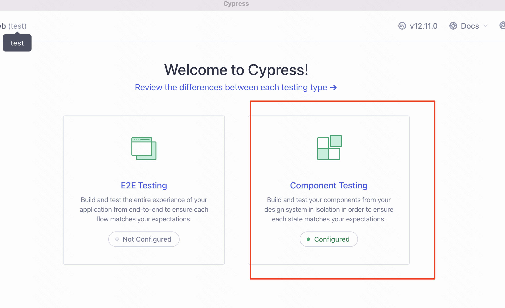
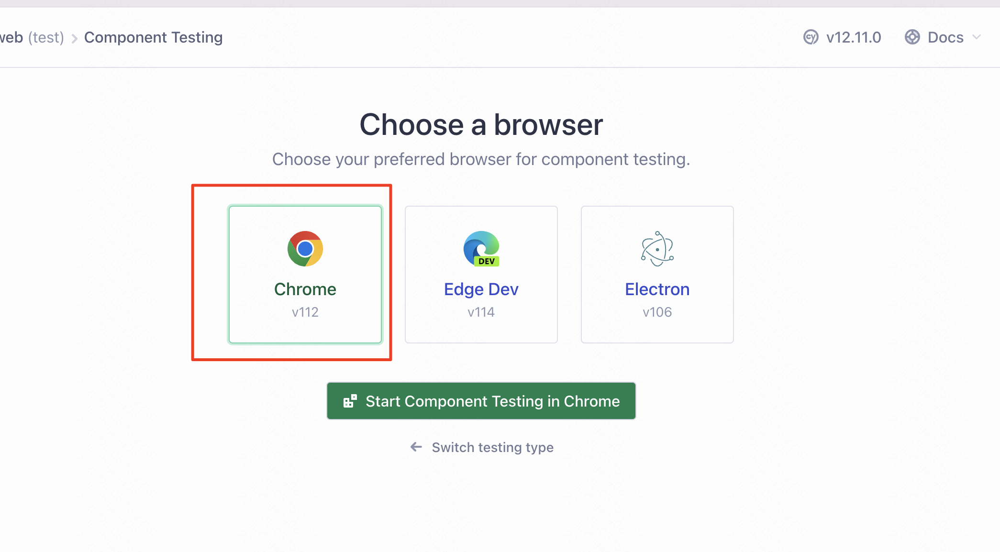
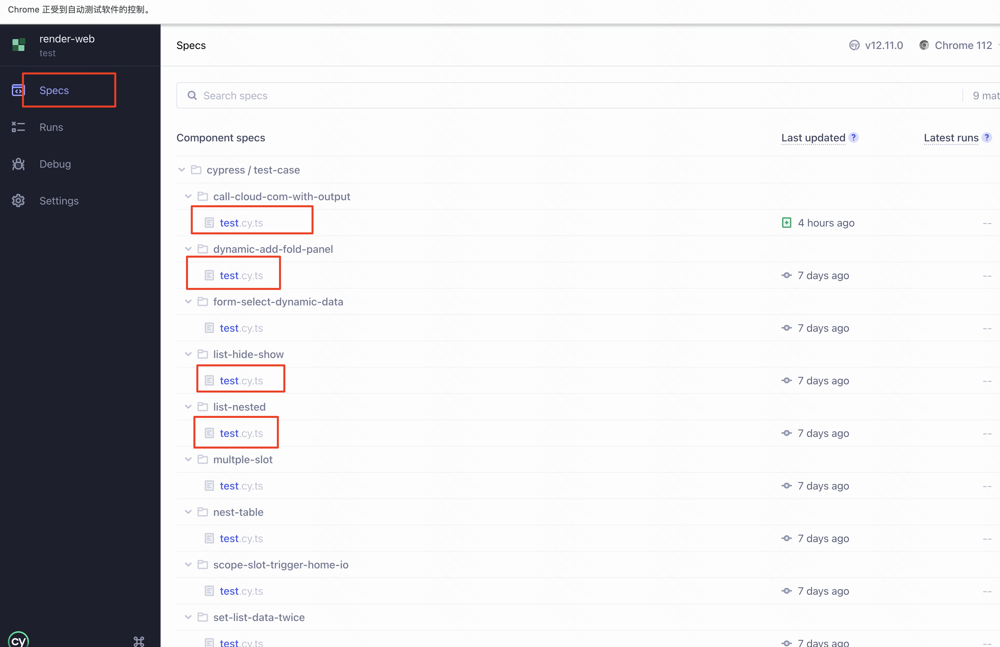
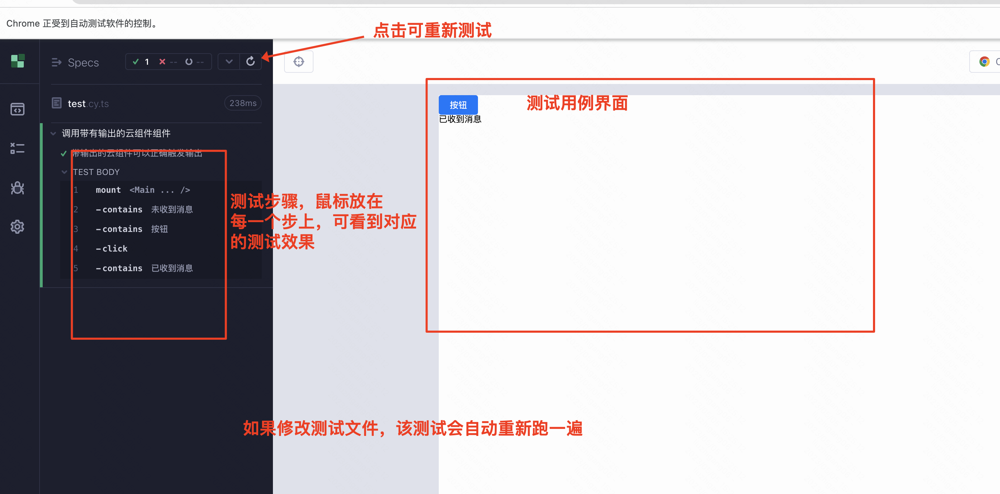

## 测试说明
  > 使用cypress进行测试，它是一个e2e的测试工具，可以通过自定义html页面，然后通过js挂载react组件模拟真实环境进行测试
  - cypress官网： [https://www.cypress.io/](https://www.cypress.io/)

 

## 测试命令
- `yarn run test`：直接在命令行跑测试
- `yarn run test-w`: 开发时，针对某一项或多项进行测试，文件修改后自动触发测试

 

### `yarn run test-w`的使用
> 某个测试用例未通过，或者添加新的测试用例时，可以使用该命令进行重复测试
- 输入`yarn run test-w`命令后，弹出测试界面，选择 `Component Testing`
  - 
- 初始化完毕后，在后面的对话框选择chrome浏览器
  - 
- 选择测试用例
  - 
- 开始测试
  - 

 

## 测试文件说明
  - `./cypress/support/component-index.html`： 模拟搭建的预览页面
  - `./cypress/test-case/xxxxxx`: 测试用例
    - `json.json`: 每个测试用例的页面内容，从搭建页面导出, 格式为 {content: .....}
    - `test.cy.ts`: 测试用例文件，定义测试的操作和断言，一般为加载json文件，挂载组件，操作页面，断言页面应该出现什么效果
  - `./cypress/test-case/utils`: 工具函数
    - `renderTestPage`：传入组件的json，可以渲染出页面
    - `comlib.js`: 组件库文件，默认为通用PC组件库，已在utils/index中已导入，组件有更新时，可以替换此文件

 

## 如何查看/修改测试用例
  > 可以通过 `yarn run test-w` 可视化查看测试，也可以通过下面的方案进行测试用例查看/修改
  - 用vscode打开[通用pc组件库](https://github.com/mybricks/comlib-pc-normal)
  - vscode安装 [mybricks插件](https://marketplace.visualstudio.com/items?itemName=Mybricks.Mybricks)
  - 复制测试用例内的`json.json`文件内容
  - 用mybricks插件调试当前的pc组件库，会自动打开一个搭建页面
  - 点击页面左上角的`调试工具`内的`从剪切板中国导入`，即可在调试页面看到测试用例
  - 直接对搭建页面进行修改，修改完毕后，点击页面左上角的`调试工具`内的`导出到剪切板`，将内容复制到json.json即可修改测试用例

 

## 如何添加新的测试
  - 在./cypress/test-case/文件夹下添加新的测试文件夹，里面包含`json.josn`和`test.cy.ts`文件
  - 添加`json.json`，可以参考上面的**查看。修改测试用例**
  - 添加`test.cy.ts`，里面挂载用例页面，然后进行操作断言即可
  > 一般验证某个问题，可以在页面添加一个文本组件，将页面的操作结果显示的修改到文本组件的内容上，通过cy.contains('特定的文本内容')来判断是否成功

 

## 如何测试带云组件
  - 可以参考`call-cloud-com-with-output`这个用例，主动加载额外的组件

